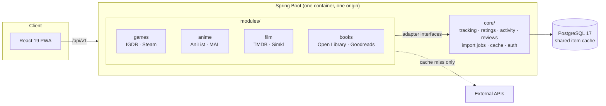

<div align="center">


# NexusLibrary

**One tracker for everything you play, watch and read.**

Games, films and TV, anime and manga, and books in a single library, with one rating
scale, one activity feed and one set of stats. Bring your history in from Steam, AniList,
MyAnimeList, Simkl and Goodreads.

[](https://github.com/initcommit43/NexusLibrary/actions/workflows/ci.yml)
[](LICENSE)


</div>

## Contents

- [Why it exists](#why-it-exists)
- [Features](#features)
- [Architecture](#architecture)
- [Engineering highlights](#engineering-highlights)
- [Stack](#stack)
- [Running locally](#running-locally)
- [Tests](#tests)
- [License and data](#license-and-data)

## Why it exists

People who track more than one medium end up with four accounts: Backloggd for games,
Serializd or Letterboxd for film and TV, AniList or MyAnimeList for anime, Goodreads for
books. Each is a good tracker and none of them talk to each other. The cross-medium tools
that do exist are mostly flat lists that don't know what a medium is.

NexusLibrary brings them together in one library. Tracking, ratings, reviews and activity
are written once and shared by every module.

## Features

- **Four modules, six media types.** Games, Movies & TV, Anime & Manga and Books. You can
  switch off the ones you don't use.
- **Library import.** Steam (OpenID), AniList, MyAnimeList and Simkl (OAuth), plus CSV
  uploads for Goodreads and the others. Imports run as background jobs and report every
  title they couldn't match.
- **Steam achievements.** A second sync collects per-game achievement progress in the
  background.
- **Tracking.** Status, a 0–100 score shown on your preferred scale, progress, start and
  finish dates, rewatch counts, notes and reviews.
- **Discovery.** Browse shelves, filters and sorting, studio and creator pages, and search
  across every enabled module.
- **Activity and stats.** A feed of every change, notifications, a yearly activity
  heatmap, completions per month and score distributions.
- **Profile.** Uploaded avatar and banner with a cropper, favourites and library shelves.
- **Accounts.** Email verification, password reset, refresh-token sessions, light and
  dark themes, and versioned consent to the legal documents.

## Architecture

NexusLibrary is a **modular monolith**: one deployable unit with hard module boundaries
inside it.



**The core owns behaviour, modules only supply data.** A module plugs in through three
small interfaces in `core/adapter`:

| Interface | What it does |
|---|---|
| `MetadataAdapter` | search, fetch by id, browse shelves and filters for its media types |
| `LibraryImportAdapter` | pull a user's library from a connected account |
| `ItemResolver` | map a provider's ids onto the canonical catalogue (Steam → IGDB, MAL → AniList, Simkl → TMDB, Goodreads → Open Library) |

Tracking, scoring, activity, import jobs and stats never mention a specific medium.
Adding a fifth module means writing adapters plus a registry entry on the frontend for
its status words and progress unit. The core doesn't change.

**One global cache, shared by every user.** Provider results are stored once per distinct
title, not per user, so the number of API calls grows with the number of different titles
being tracked, not with the number of users. That keeps free-tier provider quotas
workable for a multi-user app. Staleness depends on release state: an upcoming title is
refreshed on a TTL, while a released title is never fetched again because its metadata
has settled.

**One origin.** A single image serves the API and the built frontend. Splitting them would
make the refresh cookie cross-site, and with `SameSite=Strict` the browser would drop it,
ending every session at the first reload.

## Engineering highlights

- **Object-level authorization in the service and repository layers.** Every query is
  scoped to the authenticated user below the controller. The test suite checks that no
  route reaches another user's entry, review or connected account.
- **OAuth tokens encrypted at rest** with a stable application key, never logged.
- **Deny-by-default security chain** with an explicit public whitelist, `@Valid` on every
  inbound DTO, parameterized queries only, and generic error responses (details stay in
  the server log).
- **Rate limits** on auth, search and import endpoints, keyed on a client IP read from the
  right of `X-Forwarded-For` against a configured proxy count, because the left side can
  be forged by the client.
- **Hardened uploads.** Profile pictures are checked by magic bytes and size before
  decoding, then redrawn by the server with metadata discarded.
- **Bot protection** on sign-up and password reset with Cloudflare Turnstile, failing
  closed.
- **Schema under Flyway**, with sequential versioned migrations and no DDL from the app.

## Stack

| Layer | Choice |
|---|---|
| Backend | Java 21, Spring Boot 4, Spring Security, Spring Data JPA |
| Database | PostgreSQL 17, Flyway |
| Frontend | React 19, TypeScript, Vite, CSS Modules, installable PWA |
| Auth | JWT access tokens and rotating refresh cookies, OpenID (Steam), OAuth 2 (AniList, MAL, Simkl) |
| Testing | JUnit 5, Testcontainers (real Postgres), oxlint, `tsc` |
| Delivery | Multi-stage Docker image, GitHub Actions CI, Railway |

## Running locally

You need Docker and JDK 21, plus Node 20+ for the frontend dev server.

```bash
cp .env.example .env      # fill in the blanks; every key is documented inline
docker compose up         # the whole app on http://localhost:8080
```

For hot reload, run the parts separately:

```bash
docker compose up -d postgres
cd backend && ./mvnw spring-boot:run       # :8080, Flyway migrates on boot
cd frontend && npm install && npm run dev  # :5173, proxies /api to the backend
```

`SPRING_PROFILES_ACTIVE=dev` relaxes the cookie `Secure` flag so sign-in works over plain
http.

**Provider keys are optional, one module at a time.** Without IGDB credentials, game
search is off. Without a TMDB token, film and TV search is off. Without Steam, AniList,
MAL or Simkl keys, that connection is off. The rest of the app keeps working. Open Library
doesn't need a key.

## Tests

```bash
cd backend && ./mvnw test                      # starts Postgres 17 via Testcontainers
cd frontend && npm run lint && npm run build   # oxlint, then tsc -b && vite build
```

The backend has about 950 tests that run against a real Postgres, so migrations and
Postgres-only column types behave as they do in production. CI runs both suites on every
push. The suite covers the two claims the architecture depends on:

1. A second user tracking a title that is already cached causes **no** extra external API
   call.
2. **No** user can reach another user's data by any route.

## License and data

The source code is licensed under the [GNU Affero General Public License v3.0](LICENSE).
If you run a modified version as a network service, you must offer its source to the
people who use it.

The license covers the code only. The NexusLibrary name and the NL logo are not licensed
for use by forks. Metadata comes from IGDB, TMDB, AniList, MyAnimeList, Simkl, Steam and
Open Library. Anyone running this code needs their own API keys and must follow each
provider's terms.
